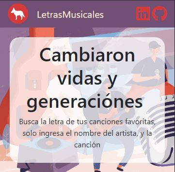
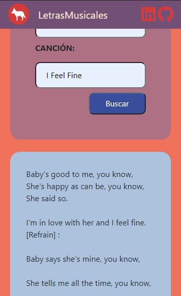

# Buscar_LetraMusic
## Consulta a un servicio de API Rest, el cual nos devuelve la letra de canciones.

###### La consulta se realizo a la API  de [lyrics.ovh](https://lyrics.ovh/).

###### La primera interface consta de dos input, en los cuales se introduce el nombre del autor de la cancion y el nombre de la respectiva canción


###### La web page, cuenta con responsive design, para adaptar los elementos de la pagina, con el tipo de pantalla que la visualiza.
<p align="center">

</p>

###### En cuanto a la prescentación de la información, está es creada en un div vacio, el cual JavaScript, utiliza para mostrar los datos.
<p align="center">

</p>


###### Los parametros que solicitamos a la API, solo fueron el artista y la canción, ademas de gestionar la respuesta en formato JSON
```Javascript
  async consultarAPI(){
        const url= await fetch (`https://api.lyrics.ovh/v1/${this.artista}/ ${this.cacion}`);
        const respuesta = await url.json();
        return{respuesta} 
```
