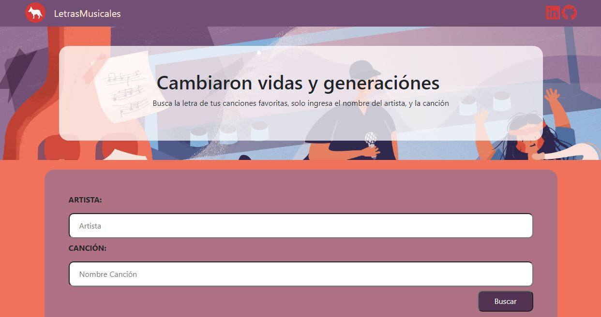

# Buscar_LetraMusic
## Consulta a un servicio de API Rest, el cual nos devuelbe la letra de cansciones.

###### La consulta se realizo a la API  de [lyrics.ovh](https://lyrics.ovh/).

###### La primera interface consta de dos input, en los cuales se introduce el nombre del autor de la cancion y el nombre de la respectiva canción

###### La web page, cuenta con responsive design, para adaptar los elementos de la pagina, con el tipo de pantalla que la visualiza.

###### En cuanto a la prescentación de la información, está es creada en un div vacio, el cual JavaScript, utiliza para mostrar los datos.

